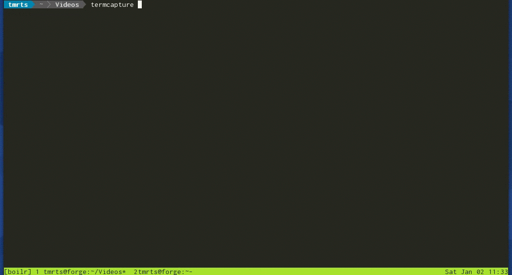

<p align="center">
  
</p>
# Boilr [![Travis Widget]][Travis] [![Release Widget]][Release] [![Report Widget]][Report] [![License Widget]][License] [![Gitter Widget]][Gitter]

[Travis Widget]: https://img.shields.io/travis/tmrts/boilr.svg?style=flat-square
[Travis]: http://travis-ci.org/tmrts/boilr
[License Widget]: https://img.shields.io/badge/license-Apache%20License%202.0-E91E63.svg?style=flat-square
[License]: https://github.com/tmrts/boilr/blob/master/LICENSE
[Release Widget]: https://img.shields.io/badge/release-v0.2.0-blue.svg?style=flat-square
[Release]: https://github.com/tmrts/boilr/releases
[Gitter Widget]: https://img.shields.io/badge/chat-on%20gitter-00BCD4.svg?style=flat-square
[Gitter]: https://gitter.im/tmrts/boilr
[Report Widget]: https://img.shields.io/badge/report%20card-A%2B-F44336.svg?style=flat-square
[Report]: http://goreportcard.com/report/tmrts/boilr
[Documentation Widget]: https://img.shields.io/badge/godoc-reference-5272B4.svg?style=flat-square
[Documentation]: https://godoc.org/github.com/tmrts/boilr

Are you doing the same steps over and over again every time you start a new programming project?

`boilr` is a powerful language-agnostic command-line boilerplate template tool here to help you.



For more details, see [Introduction](https://github.com/tmrts/boilr/wiki/Introduction) page.

# Features
- Blazingly Fast
- No dependencies (NodeJS, Python Interpreter etc.)
- Full power of [golang templates](https://golang.org/pkg/text/template/) (Easy to learn & powerful)

# Usage
Use `boilr help` to get the list of available commands.

## Download a Template
In order to download a template from a github repository, use the following command:

```bash 
boilr template download <github-repo-path> <template-tag>
boilr template download tmrts/boilr-license license
``` 

The downloaded template will be saved to local `boilr` registry.

## Save a Local Template
In order to save a template from filesystem to the template registry use the following command:

```bash 
boilr template save <template-path> <template-tag>
boilr template save ~/boilr-license license
``` 

The saved template will be saved to local `boilr` registry.

## Use a Template
In order to use a template from template registry use the following command:

```bash 
boilr template use <template-tag> <target-dir>
boilr template use license ~/Workspace/example-project/
```

You will be prompted for values when using a template.

```bash
[?] Please choose an option for "License"
    1 -  "Apache Software License 2.0"
    2 -  "MIT"
    3 -  "GNU GPL v3.0"
    Select from 1..3 [default: 1]: 2
[?] Please choose a value for "Year" [default: "2015"]:
[?] Please choose a value for "Author" [default: "Tamer Tas"]:
[✔] Created /home/tmrts/project/LICENSE
[✔] Successfully executed the project template license in /home/tmrts/project
```

For more information please take a look at [Usage](https://github.com/tmrts/boilr/wiki/Usage) and [Creating Templates](https://github.com/tmrts/boilr/wiki/Creating-Templates) pages in the wiki.

## Reporting Issues
You can report issues **directly from the command-line** by using the command, `boilr report`.

A markdown file will be opened where the first line is the issue title and the rest 
is the issue body. 

After creating the issue, save & exit the editor and you will be
prompted for github credentials needed to create the issue.

# Template Catalog
Take a look at [Templates](https://github.com/tmrts/boilr/wiki/Templates) page for a list of project templates, examples, and more information.

# Contributing
If you'd like to contribute, share your opinions or learn more, please feel free to open an issue.

At this stage, user feedback is of **utmost importance**, every contribution is welcome however small it may be.

# How Do I Get It?
There are binaries available for Linux & OSX. You can download them directly,
or run the installation script. Please see [Installation](https://github.com/tmrts/boilr/wiki/Installation) page for more information.
